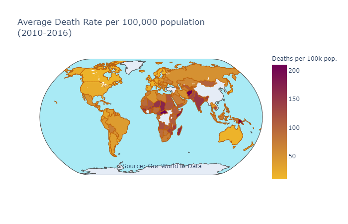
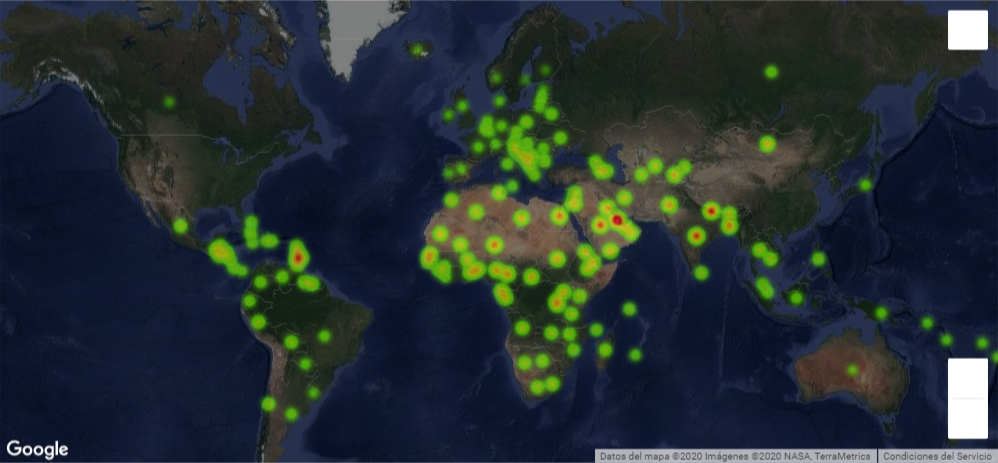

# Kyoto Protocol - World performance analysis

The project is focused on studying the effects of world agreements on global pollution by wrangling, analyzing and visualizing data from distinct sources. Also, an interface is created to observe the perfomance of specific countries depending on user input. 

## Motivation

It was found that the main expectation of the Kyoto Protocol was to reduce at least 5% emissions for the 2008/2012 period compared to the level of emissions of 1990. The motivation was precisely to find out if this objective was reached and how air pollution has developed in the last years.

## Features

* **Data wrangling** with python
* Visualizations made with plotly, matplotlib and seaborn
* Use of **Goolge API**

## Built with 

* Python
* Goolge API

## Outcomes

* Example of scatter plot made with matplotlib of average exposure to PM2.5 vs death rates. The vertical lines represent the ranges in which exposure to pollutants(PM2.5) is considered moderate, dangerous to sensitive groups, and unhealthy.

* Generated Map to visualize mean exposure to PM2.5

* Generated Map to visualize World average death rate per 100,000 population

* Google Map to visualize exposure to particulate matter 2.5 according to user input

