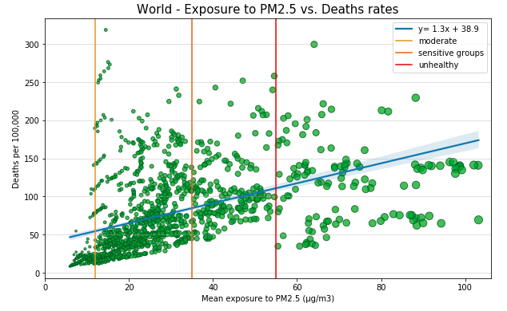
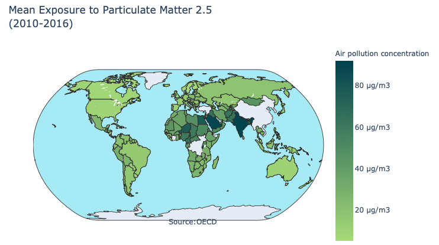

# Kyoto Protocol - World performance analysis

The project was focused on studying the effects of world accords on global pollution by wrangling, analyzing and visualizing data from distinct sources. Also, an interface was created to observe the perfomance of specific countries depending on user input. 

## Motivation

It was found that the main expectation of the Kyoto Protocol was to reduce at least 5% emissions for the 2008/2012 period compared to the level of emissions of 1990. The motivation was precisely to find out if this objective was reached and how air pollution has developed in the last years.

## Features

* Data wrangling with python
* Visualizations made with plotly, matplotlib and seaborn
* Use of Goolge API

## Built with 

* Python
* Goolge API

## Outcomes

Example of scatter plot made with matplotlib of average exposure to PM2.5 vs death rates 

Generated Map to visualize mean exposure to PM2.5

